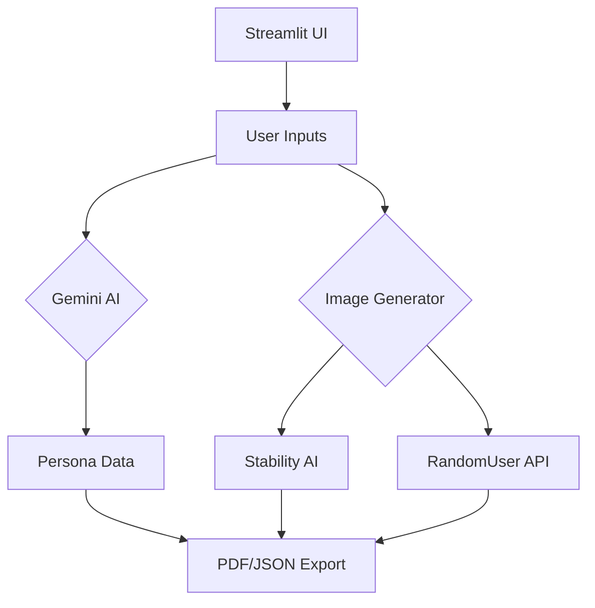

# AI Persona Builder

Generate professional user personas with AI in a few seconds. Perfect for UX designers, product managers, and researchers.

[](https://user-persona-builder-xvkeyveerkywcdgs6qtppw.streamlit.app/)


## Features

- **AI-generated personas**

  Powered by Gemini 2.0 Flash model

- **Matching profile photos**

  Uses Stability AI (via Hugging Face) with RandomUser API fallback

- **Multiple exports**

  Download as PDF or JSON

- **4 template styles**

  Auto-switches APIs if services fail

## Architecture



## How It Works

1. Enter basic details (occupation, age, gender and other information) in the form or just click the "Generate using AI".
2. AI generates persona + user photo.
3. Download the results in json format and pdf formated file.

## Tech Stack

- **Frontend**: Streamlit
- **AI Services**: Gemini, Stability AI
- **APIs**: RandomUser.me
- **Export functionality**: PDFKit, JSON

## Setup

```bash
git clone https://github.com/vzan2012/user-persona-builder.git
cd user-persona-builder
pip install -r requirements.txt
streamlit run index.py
```

## Configuration

Add your API keys to **.streamlit/secrets.toml**

(Note: Create a folder `.streamlit` folder in the project root directory and inside the folder, create file `secrets.toml`)

```toml
GEMINI_API_KEY = "your_key"
STABILITY_API_KEY = "your_key"
HUGGINGFACE_TOKEN="your_key"`
```

Create an account in the Gemini Developer platform, Hugging Face and stability website to get the API keys.

## License

[MIT](/LICENSE.md)
